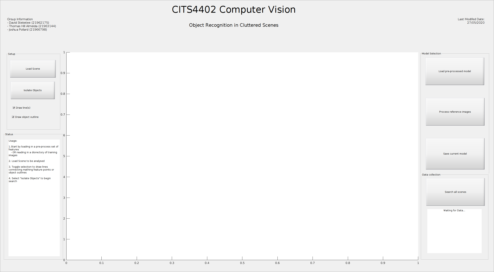
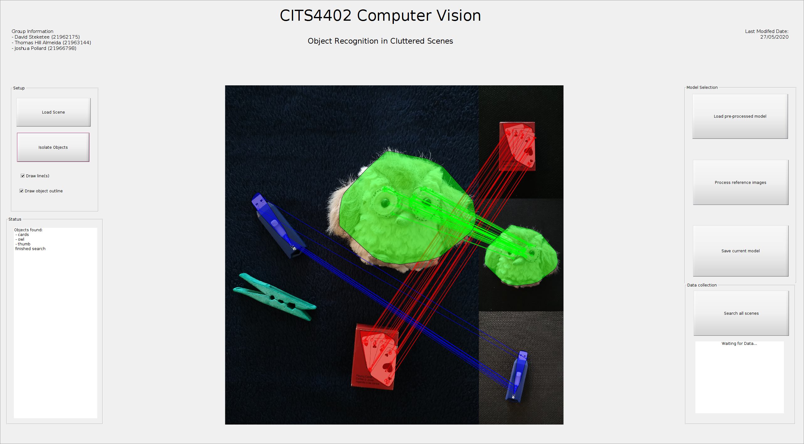

# Object Recognition in Cluttered Scenes
- David Steketee (21962175)
- Joshua Pollard (21966798)
- Thomas Hill Almeida (21963144)

The aim of this project is to build an object recognition system in MATLAB
to recognize and locate reference images in a cluttered scene.

Object detection and location is done using SURF features to be able to detect
objects present in these images with reasonable accuracy even with significant
occlusion and clutter in the scene images. The example scenes and reference
images in this repository are classified among three difficulty levels; easy,
difficult and very difficult.

Easy scene images are those with no occlusion of target objects. Difficult
scenes are those some occlusion of target objects. Very difficult images
typically have significant occlusion of target objects and clutter in the image.

## Project structure
There are a number of folders that are included as a part of this repository.
- `quick_run_pics` is a folder that contains a small number of reference and
scene images on a black background that can be quickly loaded and run
- `full_set_pics` is a folder that contains a large number of reference and
scene images on a white background that take longer to process and run
- `readme` is a folder that contains pictures used in this README

## User guide
This project requires MATLAB in order to run, and requires that this git
repository is in the PATH so that it can access the scripts needed to run.

It also requires the following Add-On is installed:
-Computer Vision Toolbox

When the GUI is first loaded, it will look like this:

There are a number of basic usage instructions that can be seen in the bottom
left of the interface.

To get started:
1. Select `Process reference images` on the right and select a directory of
reference images
    - The directory chosen must be a directory containing directories named as
    the name of the reference object, with each directory having some number of
    reference images in them
    - Once the images have finished loading, the status box on the bottom left
    will display the message "training images loaded"
2. Select `Save current model` on the right to save the trained model to a
`.mat` file
    - Previously saved structures can be loaded using the `Load pre-processed
    model` button on the right to quickly reload a trained model.
3. Select `Load Scene` on the top left and select a scene image to analyse.
4. Toggle the checkboxes on the left to select if lines should be connected
between features in the scene or if object outlines should be drawn.
5. Select `Isolate objects` to begin the search.
    - As reference images are found, they will be appended on the right hand
    side of the scene image.
    - A list of the found objects will be printed to the status box on the
    bottom left.

## Example of working search

